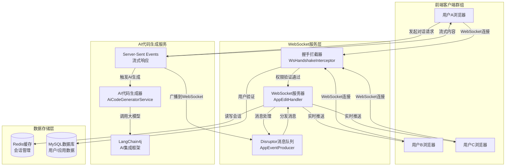
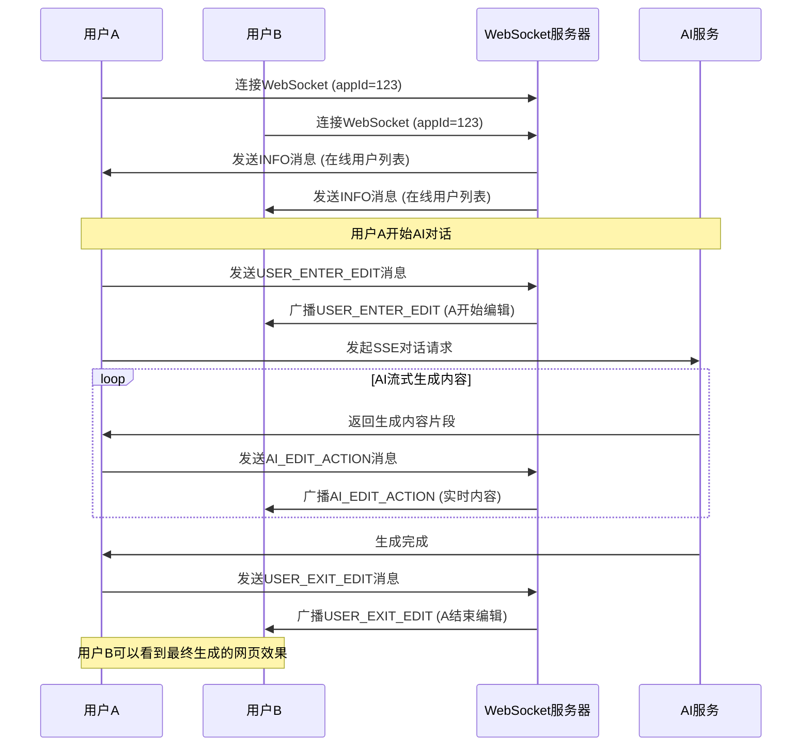

# AI Code - 智能代码生成平台

一个基于AI的代码生成平台，支持多人实时协作开发，通过WebSocket技术实现团队成员之间的实时代码生成同步。

## 项目简介

AI Code 是一个现代化的AI驱动代码生成平台，提供了强大的团队协作功能。用户可以通过自然语言描述需求，AI会自动生成相应的代码（支持HTML、多文件项目、Vue项目等），并支持团队成员实时查看代码生成过程。

## 🌟 核心特性

### 功能特性对比

| 功能特性 | 传统AI代码生成平台 | AI Code平台 |
|---------|------------------|-------------|
| AI代码生成 | ✅ 支持 | ✅ 支持 |
| 流式响应 | ⭕ 部分支持 | ✅ 完整支持 |
| **实时协作** | ❌ 不支持 | ✅ **WebSocket实时同步** |
| **多人查看生成过程** | ❌ 不支持 | ✅ **实时流式推送** |
| 团队权限管理 | ⭕ 基础功能 | ✅ 完整权限体系 |
| 在线状态显示 | ❌ 不支持 | ✅ 实时在线用户 |
| 编辑冲突处理 | ❌ 无机制 | ✅ 编辑锁定机制 |
| 代码预览 | ✅ 支持 | ✅ 实时预览 |

### 🤖 AI代码生成
- **多种生成模式**: 支持HTML网页、多文件项目、Vue项目生成
- **流式响应**: 基于Server-Sent Events (SSE)实现AI代码生成过程的实时流式显示
- **自然语言交互**: 支持中文自然语言描述需求，AI智能理解并生成相应代码
- **实时预览**: 生成的代码可即时预览效果

### 🚀 **WebSocket实时协作（核心亮点）**
本项目最突出的特性是基于WebSocket技术实现的团队实时协作功能：

#### 🔥 实时代码生成同步
- **多人协作**: 团队成员可以同时加入一个应用项目，实时查看其他人的代码生成过程
- **实时流式推送**: 当团队成员A开始与AI对话生成代码时，团队成员B可以实时看到：
  - A的提问内容
  - AI回答的实时流式输出
  - 代码生成进度和状态
- **编辑状态管理**: 支持多人编辑权限控制，同一时间只能有一个用户进行AI对话
- **在线状态显示**: 实时显示当前在线的团队成员列表

#### 🎯 协作流程
1. **用户进入编辑**: 当用户开始与AI对话时，系统通过WebSocket广播`USER_ENTER_EDIT`消息
2. **实时内容同步**: AI生成的每一段内容都会通过`AI_EDIT_ACTION`消息实时推送给团队其他成员
3. **编辑结束通知**: 代码生成完成后发送`USER_EXIT_EDIT`消息，其他成员可看到最新生成的网页效果

#### 💡 技术实现亮点
- **WebSocket连接管理**: 每个应用维护独立的WebSocket会话池，支持多用户并发连接
- **权限验证**: 连接前进行用户身份验证和应用访问权限检查
- **消息类型处理**: 支持INFO、USER_ENTER_EDIT、USER_EXIT_EDIT、AI_EDIT_ACTION等多种消息类型
- **断线重连**: 前端支持WebSocket连接状态监控和异常处理
- **并发控制**: 使用Disruptor高性能队列处理WebSocket消息，确保高并发下的稳定性

### 👥 用户管理
- **多角色支持**: 支持管理员和普通用户角色
- **团队邀请**: 支持团队成员邀请和权限管理
- **会话管理**: 基于Spring Session + Redis的分布式会话管理

### 📱 现代化UI
- **响应式设计**: 基于Vue 3 + Ant Design Vue的现代化界面
- **实时状态指示**: WebSocket连接状态、在线用户、编辑状态等实时显示
- **流畅交互**: 支持快捷键、滚动同步等良好的用户体验

## 🏗️ 技术架构

### 后端技术栈
- **框架**: Spring Boot 3.5.4
- **Java版本**: JDK 21
- **AI集成**: LangChain4j 1.1.0
- **WebSocket**: Spring WebSocket + Disruptor队列
- **数据库**: MySQL + MyBatis-Flex
- **缓存**: Redis + Caffeine
- **工具库**: Hutool 5.8.38

### 前端技术栈
- **框架**: Vue 3 (Composition API)
- **UI组件**: Ant Design Vue 4.x
- **类型系统**: TypeScript
- **状态管理**: Pinia
- **路由**: Vue Router 4
- **构建工具**: Vite
- **实时通信**: WebSocket + Server-Sent Events

### 系统架构图

下图展示了WebSocket实时协作的完整技术架构和数据流向：



#### 协作流程说明

1. **连接建立**: 用户通过WebSocket连接到服务器，经过身份验证和权限检查
2. **对话发起**: 用户A发起AI对话请求，通过SSE建立流式连接
3. **实时同步**: AI生成的内容通过WebSocket实时广播给其他在线用户
4. **状态管理**: 维护用户在线状态、编辑状态等信息，确保协作秩序

### WebSocket实时协作时序图



## 🚀 快速开始

### 环境要求
- JDK 21+
- Node.js 16+
- MySQL 8.0+
- Redis 6.0+

### 后端启动
```bash
# 1. 克隆项目
git clone <repository-url>
cd ai-code

# 2. 配置数据库和Redis连接
# 编辑 src/main/resources/application.yml

# 3. 启动后端服务
./mvnw spring-boot:run
```

### 前端启动
```bash
# 1. 进入前端目录
cd ai-code-frontend

# 2. 安装依赖
npm install

# 3. 启动开发服务器
npm run dev
```

## 📖 使用说明

### WebSocket实时协作使用指南

1. **创建团队应用**
   - 登录系统后，创建一个新的应用
   - 选择"团队应用"模式以启用WebSocket协作功能

2. **邀请团队成员**
   - 在应用设置中邀请团队成员
   - 团队成员接受邀请后可加入协作

3. **开始实时协作**
   - 所有团队成员进入应用聊天页面
   - 顶部显示在线用户列表和WebSocket连接状态
   - 当有成员开始与AI对话时，其他成员可实时看到：
     - 对话内容
     - AI回答过程
     - 代码生成进度

4. **查看生成结果**
   - 右侧预览区域实时显示生成的网页效果
   - 支持新窗口打开预览
   - 支持一键部署生成的应用

## 🔧 开发说明

### WebSocket配置说明

#### 后端配置
```java
@Configuration
@EnableWebSocket
public class WebSocketConfig implements WebSocketConfigurer {
    @Override
    public void registerWebSocketHandlers(WebSocketHandlerRegistry registry) {
        registry.addHandler(appEditHandler, "/ws/app")
                .addInterceptors(wsHandshakeInterceptor)
                .setAllowedOrigins("*");  // 生产环境需要配置具体域名
    }
}
```

#### 前端连接
```typescript
// WebSocket连接建立
const wsUrl = API_BASE_URL.replace('http', 'ws') + `/ws/app?appId=${appId}`
websocket = new WebSocket(wsUrl)

// 消息处理
websocket.onmessage = (event) => {
  const data = JSON.parse(event.data)
  handleWebSocketMessage(data)
}
```

### 环境变量配置

#### 后端配置 (application.yml)
```yaml
spring:
  # WebSocket配置
  websocket:
    allowed-origins: "*"  # 生产环境需要配置具体域名
  
  # Redis配置
  redis:
    host: localhost
    port: 6379
    database: 0
    
  # 数据库配置  
  datasource:
    url: jdbc:mysql://localhost:3306/ai_code
    username: ${DB_USERNAME:root}
    password: ${DB_PASSWORD:password}

# AI配置
langchain4j:
  open-ai:
    chat-model:
      api-key: ${OPENAI_API_KEY:your_api_key}
      base-url: ${OPENAI_BASE_URL:https://api.openai.com/v1}
```

#### 前端配置 (env.ts)
```typescript
export const API_BASE_URL = import.meta.env.VITE_API_BASE_URL || 'http://localhost:8080'
export const WS_BASE_URL = API_BASE_URL.replace('http', 'ws')
```

### WebSocket消息格式

```typescript
// 用户进入编辑状态
{
  type: 'USER_ENTER_EDIT',
  user: UserInfo,
  editAction: string  // 用户输入的内容
}

// AI代码生成流式内容
{
  type: 'AI_EDIT_ACTION', 
  user: UserInfo,
  editAction: string  // AI生成的内容片段
}

// 用户退出编辑状态
{
  type: 'USER_EXIT_EDIT',
  user: UserInfo,
  editAction: ''
}

// 服务器信息推送
{
  type: 'INFO',
  message: string,
  onlineUsers: UserInfo[],
  currentEditingUser: UserInfo
}
```

### 核心API接口

```bash
# WebSocket连接端点
ws://localhost:8080/ws/app?appId={appId}

# AI代码生成接口（SSE）
GET /app/chat/gen/code?appId={appId}&message={message}

# 应用管理接口
POST /app/add      # 创建应用
GET  /app/{id}     # 获取应用详情
POST /app/deploy   # 部署应用
```

## 🏆 项目亮点

### 1. 创新的实时协作体验
- 业界首创的AI代码生成实时协作功能
- 基于WebSocket的低延迟实时同步
- 支持多人同时观看AI代码生成过程

### 2. 高性能架构设计
- 使用Disruptor无锁队列处理高并发WebSocket消息
- 前后端分离架构，支持水平扩展
- Redis分布式会话管理，支持集群部署

### 3. 完善的工程化实践
- TypeScript全栈类型安全
- 组件化UI设计，可复用性强
- 完整的错误处理和异常恢复机制

### 4. 良好的用户体验
- 实时状态反馈，用户始终了解系统状态
- 流畅的交互动画和视觉效果
- 移动端适配，支持多设备访问

## 📝 许可证

本项目采用 [MIT License](LICENSE) 开源协议。

---

**AI Code - 让AI代码生成更协作，让团队开发更高效！** 🚀
