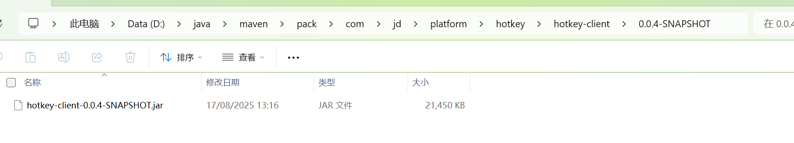

# AI Code - 智能代码生成平台

<div align="center">


**基于AI的智能代码生成平台，支持多人实时协作开发**

[](https://openjdk.java.net/projects/jdk/21/)
[](https://spring.io/projects/spring-boot)
[](https://vuejs.org/)
[](https://www.typescriptlang.org/)
[](LICENSE)

[🚀 快速开始](#-快速开始) • [📖 使用指南](#-使用指南) • [🏗️ 技术架构](#️-技术架构) • [🔧 开发文档](#-开发文档)

</div>

---

## 📖 项目简介

AI Code 是一个现代化的AI驱动代码生成平台，集成了先进的AI技术和实时协作功能。通过自然语言描述需求，AI能够智能生成多种类型的代码项目，并支持团队成员实时观看代码生成过程，实现真正的协作式AI开发体验。

### 🌟 核心亮点

- **🤖 智能代码生成**: 支持HTML、多文件项目、Vue项目等多种生成模式
- **🚀 实时协作**: 基于WebSocket的多人实时代码生成同步
- **🎯 智能路由**: AI自动分析需求，选择最适合的代码生成类型
- **📸 自动截图**: 部署后自动生成应用封面截图
- **⚡ 高性能**: 基于JDK 21虚拟线程的异步处理架构

## 🎯 功能特性

### 功能对比表

| 功能特性 | 传统AI代码生成 | AI Code平台 |
|---------|---------------|-------------|
| AI代码生成 | ✅ 基础支持 | ✅ **智能多模式生成** |
| 流式响应 | ⭕ 部分支持 | ✅ **完整流式体验** |
| **实时协作** | ❌ 不支持 | ✅ **WebSocket实时同步** |
| **多人观看生成** | ❌ 不支持 | ✅ **实时流式推送** |
| 团队权限管理 | ⭕ 基础功能 | ✅ **完整权限体系** |
| 在线状态显示 | ❌ 不支持 | ✅ **实时在线用户** |
| 编辑冲突处理 | ❌ 无机制 | ✅ **编辑锁定机制** |
| 代码预览 | ✅ 支持 | ✅ **实时预览** |
| **智能类型路由** | ❌ 不支持 | ✅ **AI自动选择** |
| **自动应用命名** | ❌ 不支持 | ✅ **AI智能命名** |
| **网页截图功能** | ❌ 不支持 | ✅ **自动生成封面** |
| **Vue项目构建** | ❌ 不支持 | ✅ **自动npm构建** |
| **虚拟线程优化** | ❌ 不支持 | ✅ **高性能异步** |
| **多级缓存架构** | ❌ 不支持 | ✅ **智能缓存体系** |
| **热点数据优化** | ❌ 不支持 | ✅ **HotKey自动检测** |

### 🤖 AI代码生成系统

#### 智能类型路由
- **AI自动分析**: 根据用户输入智能分析最适合的代码生成类型
- **三种生成模式**:
  - **HTML模式**: 适合简单的单页面应用
  - **多文件模式**: 适合复杂的多文件项目  
  - **Vue工程模式**: 适合现代化的Vue3项目
- **智能推荐**: 无需手动选择，系统自动推荐最佳方案

#### 自动应用命名
- **AI智能命名**: 根据需求描述自动生成语义化应用名称
- **长度优化**: 自动控制名称长度，确保界面美观
- **语义相关**: 生成的名称与项目内容高度相关

#### 流式代码生成
- **实时响应**: 基于Server-Sent Events (SSE)的流式显示
- **自然语言交互**: 支持中文自然语言描述需求
- **即时预览**: 生成的代码可实时预览效果

### 🚀 WebSocket实时协作（核心特色）

#### 实时代码生成同步
- **多人协作**: 团队成员同时加入项目，实时查看代码生成过程
- **实时流式推送**: 当成员A与AI对话时，成员B可实时看到：
  - A的提问内容
  - AI回答的实时流式输出
  - 代码生成进度和状态
- **编辑状态管理**: 支持多人编辑权限控制
- **在线状态显示**: 实时显示在线团队成员列表

#### 协作流程
1. **用户进入编辑**: 开始AI对话时广播`USER_ENTER_EDIT`消息
2. **实时内容同步**: AI生成内容通过`AI_EDIT_ACTION`实时推送
3. **编辑结束通知**: 完成后发送`USER_EXIT_EDIT`消息

### 📸 自动化功能

#### 网页截图服务
- **自动截图**: 应用部署后自动生成网页截图作为封面
- **异步处理**: 使用虚拟线程异步处理，不阻塞主流程
- **云端存储**: 自动上传到对象存储，支持CDN加速
- **图片压缩**: 自动压缩优化存储和加载性能

#### Vue项目构建系统
- **自动构建**: Vue项目生成后自动执行`npm install`和`npm run build`
- **构建验证**: 验证构建结果，确保dist目录可用
- **异步构建**: 使用虚拟线程异步执行，提升用户体验
- **跨平台支持**: 支持Windows和Linux环境

### ⚡ 高性能架构

#### 虚拟线程优化
- **JDK 21虚拟线程**: 处理耗时任务，占用更少系统资源
- **高并发支持**: 支持大量并发异步任务
- **应用场景**: 截图生成、Vue项目构建、文件上传等

#### 多级缓存架构
- **AI服务实例缓存**: 基于Caffeine的本地缓存，最大1000个实例，30分钟过期
- **Redis分布式缓存**: 存储会话、聊天记忆、点赞状态等分布式数据
- **HotKey热点缓存**: 自动检测热点数据，本地缓存减少Redis压力
- **应用数据缓存**: 应用详情、列表分页等数据缓存，提升查询性能

#### 技术架构亮点
- **Disruptor队列**: 高性能无锁队列处理WebSocket消息
- **分布式会话**: 基于Redis的分布式会话管理
- **前后端分离**: 支持水平扩展的微服务架构

## 🏗️ 技术架构

### 设计模式架构

本项目在代码生成和文件保存方面采用了多种设计模式，确保代码的可扩展性和可维护性。

#### 策略模式 - 代码解析器

```mermaid
flowchart TB
    C[客户端\nClient]
    I[策略接口\nCodeParser]
    H[HTML解析策略\nHtmlCodeParser]
    M[多文件解析策略\nMultiFileCodeParser]
    RH[返回HtmlCodeResult]
    RM[返回MultiFileCodeResult]

    C --> I
    I --> H
    I --> M
    H --> RH
    M --> RM
```



- **策略接口**: `CodeParser<T>` 定义了通用的代码解析接口
- **HTML解析策略**: `HtmlCodeParser` 专门处理HTML代码解析，返回 `HtmlCodeResult`
- **多文件解析策略**: `MultiFileCodeParser` 处理多文件项目解析，返回 `MultiFileCodeResult`
- **优势**: 客户端可以根据不同需求灵活选择解析策略，无需修改核心逻辑

#### 模板方法模式 - 文件保存器

```mermaid
flowchart TB
    A[抽象模板类\nCodeFileSaverTemplate]
    T[模板方法\nsaveCode]
    AF[saveFiles - 抽象方法]
    H[HTML保存器\nHtmlCodeFileSaverTemplate]
    M[多文件保存器\nMultiFileCodeFileSaverTemplate]
    IH[实现saveFiles\n保存index.html]
    IM[实现saveFiles\n保存html+css+js]

    A --> T
    T --> AF
    A --> H
    A --> M
    H --> IH
    M --> IM
```



- **抽象模板类**: `CodeFileSaverTemplate<T>` 定义了文件保存的通用流程
- **模板方法**: `saveCode()` 方法定义了保存算法的骨架
- **抽象方法**: `saveFiles()` 由具体子类实现不同的保存逻辑
- **HTML保存器**: `HtmlCodeFileSaverTemplate` 专门保存单文件HTML项目
- **多文件保存器**: `MultiFileCodeFileSaverTemplate` 保存包含HTML、CSS、JS的多文件项目

#### 执行器模式 - 保存流程控制

```mermaid
flowchart TB
    E[保存执行器\nCodeFileSaverExecutor]
    R[根据CodeGenTypeEnum\n选择保存模板]
    H[HtmlCodeFileSaverTemplate]
    M[MultiFileCodeFileSaverTemplate]

    E --> R
    R --> H
    R --> M
```



- **保存执行器**: `CodeFileSaverExecutor` 作为统一的入口点
- **类型路由**: 根据 `CodeGenTypeEnum` 动态选择对应的保存模板
- **模板选择**: 自动选择 `HtmlCodeFileSaverTemplate` 或 `MultiFileCodeFileSaverTemplate`
- **优势**: 实现了保存逻辑的解耦，支持新类型扩展

### 后端技术栈

| 技术 | 版本 | 用途 |
|------|------|------|
| **Spring Boot** | 3.5.4 | 主框架 |
| **Java** | JDK 21 | 运行时（支持虚拟线程） |
| **LangChain4j** | 1.1.0 | AI集成框架 |
| **Spring WebSocket** | - | 实时通信 |
| **Disruptor** | - | 高性能消息队列 |
| **MySQL** | 8.0+ | 主数据库 |
| **MyBatis-Flex** | - | ORM框架 |
| **Redis** | 6.0+ | 分布式缓存和会话 |
| **Caffeine** | - | 本地缓存 |
| **HotKey** | - | 热点数据缓存 |
| **Selenium** | - | 网页截图 |
| **腾讯云COS** | - | 对象存储 |

### 前端技术栈

| 技术 | 版本 | 用途 |
|------|------|------|
| **Vue 3** | 3.4+ | 前端框架（Composition API） |
| **TypeScript** | 5.0+ | 类型系统 |
| **Ant Design Vue** | 4.x | UI组件库 |
| **Pinia** | - | 状态管理 |
| **Vue Router** | 4.x | 路由管理 |
| **Vite** | - | 构建工具 |
| **WebSocket** | - | 实时通信 |

### 系统架构图

```mermaid
graph TB
    subgraph "前端客户端"
        A[用户A浏览器]
        B[用户B浏览器] 
        C[用户C浏览器]
    end
    
    subgraph "WebSocket服务层"
        WS[WebSocket服务器<br/>AppEditHandler]
        AUTH[握手拦截器<br/>WsHandshakeInterceptor]
        QUEUE[Disruptor消息队列<br/>AppEventProducer]
    end
    
    subgraph "AI代码生成服务"
        AI[AI代码生成器<br/>AiCodeGeneratorService]
        SSE[Server-Sent Events<br/>流式响应]
        LANG[LangChain4j<br/>AI集成框架]
        ROUTER[智能类型路由<br/>AiCodeGenTypeRoutingService]
        NAMER[应用名称生成<br/>AiCodeGenNameService]
    end
    
    subgraph "异步处理服务"
        VT[虚拟线程池<br/>异步任务处理]
        SCREEN[网页截图服务<br/>ScreenshotService]
        BUILDER[Vue项目构建<br/>VueProjectBuilder]
        COS[对象存储<br/>CosManager]
    end
    
    subgraph "数据存储层"
        REDIS[(Redis分布式缓存<br/>会话/聊天记忆/点赞)]
        CACHE[(本地缓存<br/>AI实例/热点数据)]
        MYSQL[(MySQL数据库<br/>用户/应用数据)]
    end
    
    A -->|WebSocket连接| AUTH
    B -->|WebSocket连接| AUTH  
    C -->|WebSocket连接| AUTH
    
    AUTH -->|权限验证通过| WS
    WS -->|消息处理| QUEUE
    
    A -->|发起对话请求| SSE
    SSE -->|触发AI生成| AI
    AI -->|调用大模型| LANG
    AI -->|智能路由| ROUTER
    AI -->|生成名称| NAMER
    
    SSE -->|流式内容| A
    SSE -->|广播到WebSocket| QUEUE
    QUEUE -->|分发消息| WS
    
    WS -->|实时推送| B
    WS -->|实时推送| C
    
    WS -->|读写会话| REDIS
    AUTH -->|用户验证| MYSQL
    AI -->|缓存实例| CACHE
    
    AI -->|异步任务| VT
    VT -->|截图任务| SCREEN
    VT -->|构建任务| BUILDER
    SCREEN -->|上传文件| COS
```



### WebSocket实时协作时序图

```mermaid
sequenceDiagram
    participant A as 用户A
    participant B as 用户B
    participant WS as WebSocket服务器
    participant AI as AI服务
    participant VT as 虚拟线程

    A->>WS: 连接WebSocket (appId=123)
    B->>WS: 连接WebSocket (appId=123)
    WS->>A: 发送INFO消息 (在线用户列表)
    WS->>B: 发送INFO消息 (在线用户列表)

    Note over A,AI: 用户A开始AI对话

    A->>WS: 发送USER_ENTER_EDIT消息
    WS->>B: 广播USER_ENTER_EDIT (A开始编辑)
    A->>AI: 发起SSE对话请求
    
    AI->>AI: 智能分析生成类型
    AI->>AI: 生成应用名称
    
    loop AI流式生成内容
        AI->>A: 返回生成内容片段
        A->>WS: 发送AI_EDIT_ACTION消息
        WS->>B: 广播AI_EDIT_ACTION (实时内容)
    end

    AI->>A: 生成完成
    A->>WS: 发送USER_EXIT_EDIT消息
    WS->>B: 广播USER_EXIT_EDIT (A结束编辑)
    
    Note over A,VT: 部署应用
    A->>VT: 异步生成截图
    A->>VT: 异步构建Vue项目
    VT->>VT: 上传截图到COS
    VT->>VT: 执行npm构建
    
    Note over A,B: 用户B可以看到最终生成的网页效果和截图封面
```



## 🚀 快速开始

### 环境要求

- **JDK**: 21+
- **Node.js**: 16+
- **MySQL**: 8.0+
- **Redis**: 6.0+
- **浏览器**: Edge（网页截图功能）

### HotKey 依赖安装（必须）

本项目使用了 HotKey 热点数据组件。由于该依赖未发布到公共仓库，需手动将 `lib/` 中的 JAR 安装到本地 Maven 仓库后再编译运行。

1) 确认本地 JAR 位置

- 位置：`lib/hotkey-client-0.0.4-SNAPSHOT.jar`

2) 执行安装命令（Windows PowerShell 示例）

```bash
mvn install:install-file ^
  -Dfile=lib/hotkey-client-0.0.4-SNAPSHOT.jar ^
  -DgroupId=jd.platform ^
  -DartifactId=hotkey-client ^
  -Dversion=0.0.4-SNAPSHOT ^
  -Dpackaging=jar
```

安装成功后，本地 Maven 仓库中会出现路径：`~/.m2/repository/jd/platform/hotkey/hotkey-client/0.0.4-SNAPSHOT/`。

安装效果示例（相对路径图片）：


### 后端启动

```bash
# 1. 克隆项目
git clone <repository-url>
cd ai-code

# 2. 配置数据库和Redis连接
# 编辑 src/main/resources/application.yml

# 3. 启动后端服务
./mvnw spring-boot:run
```

### 前端启动

```bash
# 1. 进入前端目录
cd ai-code-frontend

# 2. 安装依赖
npm install

# 3. 启动开发服务器
npm run dev
```

## 📖 使用指南

### 智能代码生成使用指南

#### 1. 创建应用
- 在首页输入应用需求描述
- 系统自动分析并选择最适合的代码生成类型
- AI自动生成合适的应用名称

#### 2. 开始AI对话
- 进入应用聊天页面
- 用自然语言描述需求
- AI实时生成代码并显示预览

#### 3. 部署应用
- 点击部署按钮
- 系统自动构建项目（Vue项目会执行npm构建）
- 部署完成后自动生成网页截图作为封面

### WebSocket实时协作使用指南

#### 1. 创建团队应用
- 登录系统后，创建一个新的应用
- 选择"团队应用"模式以启用WebSocket协作功能

#### 2. 邀请团队成员
- 在应用设置中邀请团队成员
- 团队成员接受邀请后可加入协作

#### 3. 开始实时协作
- 所有团队成员进入应用聊天页面
- 顶部显示在线用户列表和WebSocket连接状态
- 当有成员开始与AI对话时，其他成员可实时看到：
  - 对话内容
  - AI回答过程
  - 代码生成进度

#### 4. 查看生成结果
- 右侧预览区域实时显示生成的网页效果
- 支持新窗口打开预览
- 支持一键部署生成的应用
- 部署后自动显示应用截图封面

## 🖼️ 界面预览

> 以下为平台主要页面的实际效果截图（均为相对路径 `image/` 下的资源）。

### 首页


### 推荐页


### 对话页


### 协同开发


### 应用管理页面


### 用户管理页面


### 个人信息页


## 🔧 开发文档

### 核心配置

#### 智能代码生成类型路由
```java
@SystemMessage(fromResource = "prompt/codegen-routing-system-prompt.txt")
CodeGenTypeEnum routeCodeGenType(String userPrompt);
```

#### 自动应用名称生成
```java
@SystemMessage(fromResource = "prompt/codegen-app-name-prompt.txt")
String generateAppName(String userMessage);
```

#### 网页截图服务
```java
@Service
public class ScreenshotServiceImpl implements ScreenshotService {
    public String generateAndUploadScreenshot(String webUrl) {
        // 使用Selenium WebDriver生成截图
        // 压缩图片并上传到对象存储
    }
}
```

#### Vue项目构建
```java
@Component
public class VueProjectBuilder {
    public boolean buildProject(String projectPath) {
        // 执行npm install
        // 执行npm run build
        // 验证dist目录
    }
}
```

#### 虚拟线程异步处理
```java
// 异步生成应用截图
Thread.startVirtualThread(() -> {
    String screenshotUrl = screenshotService.generateAndUploadScreenshot(appUrl);
    // 更新数据库封面
});

// 异步构建Vue项目
Thread.ofVirtual().name("vue-builder-" + System.currentTimeMillis())
    .start(() -> {
        vueProjectBuilder.buildProject(projectPath);
    });
```

#### 多级缓存配置
```java
// AI服务实例缓存（Caffeine本地缓存）
private final Cache<String, AiCodeGeneratorService> serviceCache = Caffeine.newBuilder()
    .maximumSize(1000)
    .expireAfterWrite(Duration.ofMinutes(30))
    .expireAfterAccess(Duration.ofMinutes(10))
    .build();

// Redis聊天记忆存储
@Bean
public RedisChatMemoryStore redisChatMemoryStore() {
    return RedisChatMemoryStore.builder()
        .host(host)
        .port(port)
        .password(password)
        .ttl(ttl)
        .build();
}

// HotKey热点缓存注解
@HotKeyCache(prefix = "app_detail_", expireSeconds = 300)
@HotKeyCache(prefix = "thumb_is_liked:", expireSeconds = 600)
```

### WebSocket配置

#### 后端配置
```java
@Configuration
@EnableWebSocket
public class WebSocketConfig implements WebSocketConfigurer {
    @Override
    public void registerWebSocketHandlers(WebSocketHandlerRegistry registry) {
        registry.addHandler(appEditHandler, "/ws/app")
                .addInterceptors(wsHandshakeInterceptor)
                .setAllowedOrigins("*");  // 生产环境需要配置具体域名
    }
}
```

#### 前端连接
```typescript
// WebSocket连接建立
const wsUrl = API_BASE_URL.replace('http', 'ws') + `/ws/app?appId=${appId}`
websocket = new WebSocket(wsUrl)

// 消息处理
websocket.onmessage = (event) => {
  const data = JSON.parse(event.data)
  handleWebSocketMessage(data)
}
```

### 环境变量配置

#### 后端配置 (application.yml)
```yaml
spring:
  # WebSocket配置
  websocket:
    allowed-origins: "*"  # 生产环境需要配置具体域名
  
  # Redis配置
  redis:
    host: localhost
    port: 6379
    database: 0
    
  # 数据库配置  
  datasource:
    url: jdbc:mysql://localhost:3306/ai_code
    username: ${DB_USERNAME:root}
    password: ${DB_PASSWORD:password}

# AI配置
langchain4j:
  open-ai:
    chat-model:
      api-key: ${OPENAI_API_KEY:your_api_key}
      base-url: ${OPENAI_BASE_URL:https://api.openai.com/v1}

# 对象存储配置
cos:
  secret-id: ${COS_SECRET_ID:your_secret_id}
  secret-key: ${COS_SECRET_KEY:your_secret_key}
  region: ${COS_REGION:ap-beijing}
  bucket-name: ${COS_BUCKET_NAME:your_bucket}

# HotKey热点缓存配置
hotkey:
  app-name: easenAi
  caffeine-size: 10000
  push-period: 1000
  etcd-server: http://localhost:2379
```

#### 前端配置 (env.ts)
```typescript
export const API_BASE_URL = import.meta.env.VITE_API_BASE_URL || 'http://localhost:8080'
export const WS_BASE_URL = API_BASE_URL.replace('http', 'ws')
```

### WebSocket消息格式

```typescript
// 用户进入编辑状态
{
  type: 'USER_ENTER_EDIT',
  user: UserInfo,
  editAction: string  // 用户输入的内容
}

// AI代码生成流式内容
{
  type: 'AI_EDIT_ACTION', 
  user: UserInfo,
  editAction: string  // AI生成的内容片段
}

// 用户退出编辑状态
{
  type: 'USER_EXIT_EDIT',
  user: UserInfo,
  editAction: ''
}

// 服务器信息推送
{
  type: 'INFO',
  message: string,
  onlineUsers: UserInfo[],
  currentEditingUser: UserInfo
}
```

### 核心API接口

```bash
# WebSocket连接端点
ws://localhost:8080/ws/app?appId={appId}

# AI代码生成接口（SSE）
GET /app/chat/gen/code?appId={appId}&message={message}

# 应用管理接口
POST /app/add      # 创建应用（自动生成类型和名称）
GET  /app/{id}     # 获取应用详情
POST /app/deploy   # 部署应用（自动截图和构建）

# 截图相关接口
POST /screenshot/generate  # 手动生成截图
```

## 🏆 项目亮点

### 1. 创新的实时协作体验
- **业界首创**: AI代码生成实时协作功能
- **低延迟同步**: 基于WebSocket的实时通信
- **多人观看**: 支持团队同时观看AI代码生成过程

### 2. 智能化的代码生成
- **智能路由**: AI自动分析需求，选择最佳生成类型
- **语义命名**: 自动生成与应用内容相关的名称
- **多模式支持**: HTML、多文件、Vue项目等多种生成模式

### 3. 完整的应用生命周期管理
- **端到端流程**: 从需求描述到部署上线的完整流程
- **自动截图**: 部署后自动生成应用封面
- **自动构建**: Vue项目自动npm构建，确保生产可用性

### 4. 高性能架构设计
- **虚拟线程**: JDK 21虚拟线程处理异步任务
- **无锁队列**: Disruptor高性能队列处理WebSocket消息
- **分布式架构**: 支持水平扩展的微服务架构
- **会话管理**: Redis分布式会话，支持集群部署

### 5. 完善的工程化实践
- **类型安全**: TypeScript全栈类型安全
- **组件化设计**: 可复用的UI组件设计
- **错误处理**: 完整的异常处理和恢复机制
- **自动化测试**: 完善的测试覆盖

### 6. 优秀的用户体验
- **实时反馈**: 用户始终了解系统状态
- **流畅交互**: 丰富的交互动画和视觉效果
- **多设备支持**: 响应式设计，支持移动端
- **智能化**: 减少用户操作复杂度

### 7. 完善的缓存体系
- **多级缓存**: 本地缓存+分布式缓存+热点缓存
- **智能缓存**: AI服务实例智能缓存，提升响应速度
- **热点优化**: HotKey自动检测热点数据，减少Redis压力
- **缓存预热**: 用户访问时自动预热相关缓存
- **数据一致性**: 完善的缓存更新和失效机制

---

<div align="center">

**AI Code - 让AI代码生成更智能，让团队开发更高效！** 🚀

[⬆ 回到顶部](#ai-code---智能代码生成平台)

</div>
